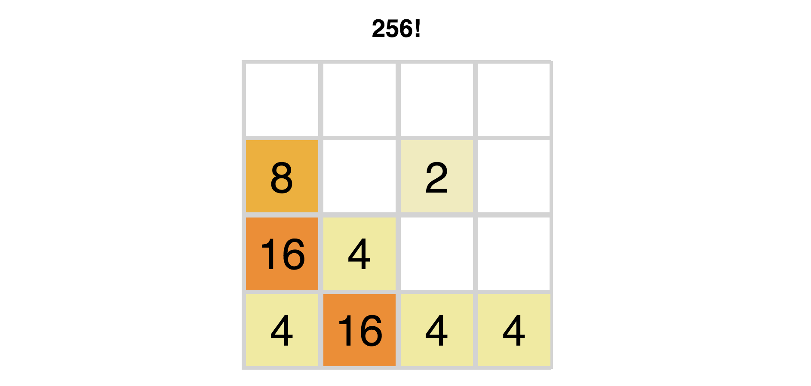

# 2048 Clone

View [live game here](https://mindplace.github.io/2048-clone/)

This is a clone of the popular [2048 game](https://gabrielecirulli.github.io/2048/) by Gabriele Cirulli. I built this clone with vanilla JavaScript and some jQuery, and designed in a way where state is taken from the DOM for each consecutive move.

## Technologies

* OOP JavaScript
* HTML & CSS
